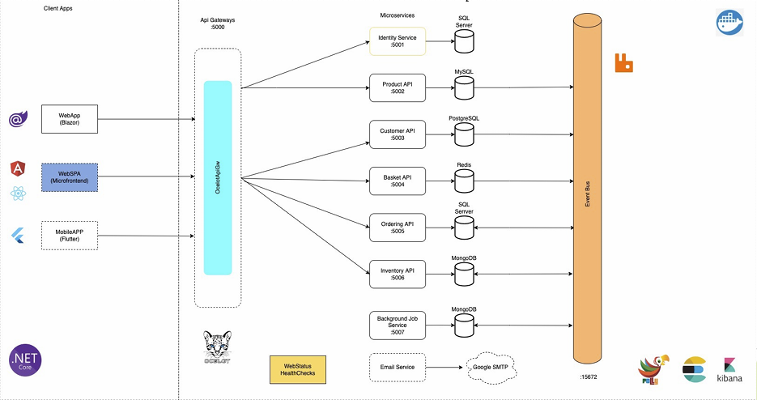

## AspnetCore Application Microservices:

## Environment:

* dotnet version in file `global.json`
* Visual Code/Studio
* Docker Desktop

## How to run project

Run command for build:
```Powershell
dotnet build
```

Go to folder contain file `docker-compose`

1. Using docker-compose
```Powershell
docker-compose -f docker-compose.yml -f docker-compose.override.yml up -d --remove-orphans
```

## Application URLS - LOCAL Environment (Docker Container):
- Product API: http://localhost:6002/api/products
- Customer API: http://localhost:6003/api/customers
- Basket API: http://localhost:6004/api/baskets

## Docker Application URLS - LOCAL Environment (Docker Container):
- Portainer: http://localhost:9000 - username: admin; pass: 123Pa$$word!
- kibana: http://localhost:5601 - username: elastic; pass: admin
- RabbitMQ: http://localhost:15672 - username: guest; pass: guest

2. Using Visual Studio
- Open microservices.sln - `microservices.sln`
- Run Compound to start multi project:
---
## Application URLS - DEVELOPMENT Environment:
- Product API: http://localhost:5002/api/products
- Customer API: http://localhost:5003/api/customers
- Basket API: http://localhost:5004/api/baskets
---
## Application URLS - PRODUCTION Environment:

---
## Packages References:

## Install Environment:

- https://dotnet.microsoft.com/download/dotnet/6.0
- https://visualstudio.microsoft.com/

## References URLS:

## Docker Commands:

- docker-compose -f docker-compose.yml -f docker-compose.override.yml up -d --remove-orphans --build

## Useful Commands:

- ASPNETCORE_ENVIRONMENT=Production dotnet ef database update
- dotnet watch run --environment "Development"
- dotnet restore
- dotnet build
- Migration Command: CD Ordering folder then
 - dotnet ef migrations add "SampleMessage" --project {project dir} --startup-project {project dir} --output-dir {project dir}/Migrations
 - dotnet ef migrations remove --project Ordering.Infrastructure --startup-project Ordering.API
 - dotnet ef database drop -f -v
 - dotnet ef database update --project Ordering.Infrastructure --startup-project Ordering.API

## Design Architecture:

